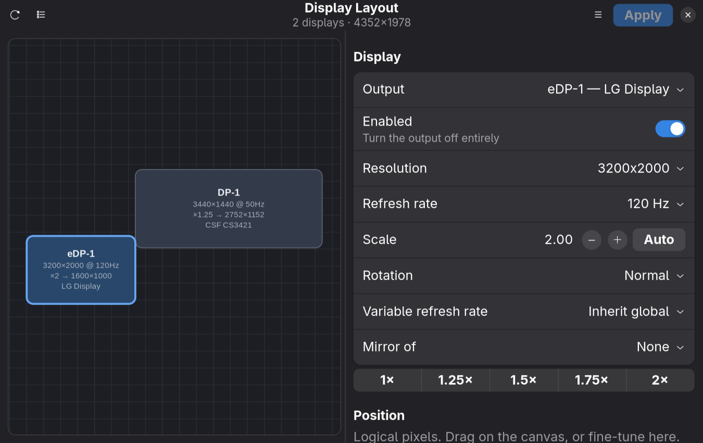
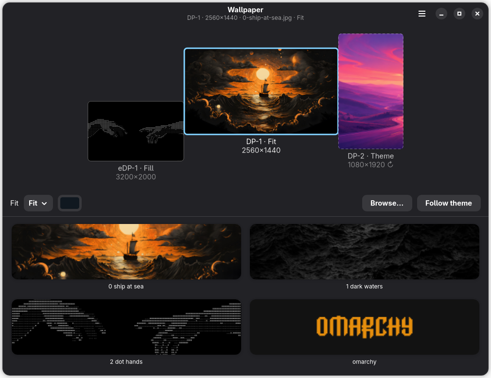

# displaywright

Where your displays are, and what is drawn on them — one window for both.

Drag your outputs into place and displaywright applies it live with `hyprctl`,
then writes it back to Omarchy's Lua `monitors.lua`. Give each display its own
wallpaper and an `omarchy-shell` plugin draws it, replacing the built-in
background renderer that only ever showed one picture on every screen.

Both halves share one view of your desk, so a display you select or move on one
page is the same display on the other.

[](https://github.com/BlackKingBarOrg/displaywright/actions/workflows/tests.yml)





## Install

```bash
omarchy plugin add https://github.com/BlackKingBarOrg/displaywright-shell-plugin.git --enable
omarchy plugin disable omarchy.background
```

**Both lines.** `omarchy plugin add` will not disable the built-in renderer for
you, and two plugins drawing on `WlrLayer.Background` means the wallpaper you
get is a coin flip per session. Theme switching keeps working — displaywright
implements the whole `background` IPC target, palette transition included.

That is the wallpaper renderer, and it is driven by
`~/.config/displaywright/wallpapers.json` — the format is in
[`plugin/README.md`](plugin/README.md).

### The window

Picture library, a live preview of every fit, and the display arrangement
editor. Nothing is compiled; `make install` symlinks `displaywright` onto your
`PATH` and adds the launcher entry:

```bash
git clone https://github.com/BlackKingBarOrg/displaywright
cd displaywright
make install
```

Then run `displaywright`, or search **Displaywright** in the app menu
(SUPER + ALT + SPACE). It writes the same file the renderer reads, and
`make plugin` installs the renderer for you if you skipped the two commands
above.

Coming from **wallwright** or **hyprlayout**, which this merges: `displaywright
migrate` moves your wallpapers, profiles and renderer across. It never
overwrites anything, and running it twice does nothing.

## Displays

- **Drag to arrange.** Tiles snap to their neighbours' edges and centre lines,
  with no overlaps or gaps on release. Arrow keys nudge 10 logical pixels, Shift
  makes it 100.
- **Per-display settings.** Enable, resolution, refresh rate, scale (with an
  Auto that reads the panel's real DPI from its EDID), rotation, VRR, mirroring,
  exact X/Y.
- **Try before you keep.** Apply takes effect immediately, then asks to keep or
  revert with a **15-second countdown that defaults to revert** — a display that
  goes black cannot lock you out.
- **Careful writes.** You get a diff before `monitors.lua` is touched, the old
  file is backed up, and only displaywright's own managed block is rewritten.
- **Profiles.** Save arrangements and recognise them again by output
  fingerprint.
- **Warnings** for overlaps, displays the pointer cannot reach across a gap, and
  scales that produce a fractional logical size.

Unlike `nwg-displays`, it speaks Hyprland 0.56's **Lua** dialect on both ends —
`hl.monitor({ ... })` written to disk, `hyprctl eval` to apply — falling back to
hyprlang `keyword` on older builds.

## Wallpapers

- **A picture per display**, or one **spanned** across all of them, cut from
  your real layout and honest about how much falls in the gaps.
- **Every fit Windows has**, behaving the way Windows' do — including on a
  scaled display, where most tools get Center and Tile wrong.
- **A preview that is not a guess.** It runs the same arithmetic the renderer
  does, so you see what Center will do before committing.
- **Displays you have not touched** keep following the Omarchy theme background,
  so a fresh install looks like stock Omarchy.
- **One folder.** Everything you pick is copied into `~/Pictures/Displaywright`,
  so a wallpaper survives you emptying `~/Downloads`.
- Flat colours and video as well as pictures. No Apply button here — a wallpaper
  is visible the moment it lands.

The fit table and the `wallpapers.json` format are documented in
[`plugin/README.md`](plugin/README.md).

## Command line

```bash
displaywright                       # the window
displaywright outputs               # the displays Hyprland reports

displaywright layout status|dump|lua|diff|save
displaywright layout builtin on|off|toggle
displaywright layout profiles
displaywright layout profile-save|profile-apply|profile-delete <name>

displaywright wallpaper status
displaywright wallpaper set DP-1 ~/a.jpg [--fit tile] [--backdrop '#101820'] [--no-copy]
displaywright wallpaper set span ~/wide.jpg
displaywright wallpaper color DP-1 '#101820'
displaywright wallpaper clear [DP-1]

displaywright renderer status|install|uninstall
displaywright migrate
```

Worth a keybinding in `~/.config/hypr/bindings.lua`:

```lua
o.bind("SUPER + P", "Displays and wallpapers", { launch = "displaywright" })
o.bind("SUPER + SHIFT + P", "Dock layout", "displaywright layout profile-apply dock")
```

## Keyboard

| Key | Action |
| --- | --- |
| Arrows / Shift+Arrows | Move the selected display 10 / 100 logical pixels |
| Tab | Cycle the selection on the canvas |
| Ctrl+Return | Apply the arrangement |
| Ctrl+S | Save to `monitors.lua` |
| Ctrl+R | Re-read displays from Hyprland |
| Ctrl+Z | Discard arrangement changes |
| Ctrl+Q | Quit |

Apply is a trial: it does not survive `hyprctl reload`. Ctrl+S, or the
*Also write…* tick in the confirmation, is what makes it stick. Both emit the
same Lua, so the diff you preview is what runs.

## Turning the laptop panel off

Switch the built-in display off while docked and it comes back on its own once
no external display is left — whether or not this app is running.

That is not something displaywright invents. Writing `disabled = true` for a
laptop panel into `monitors.lua` is a trap: nothing removes it, so the next time
you undock you get a black machine. Omarchy already ships the pieces that avoid
it — `internal-monitor-disable.lua`, plus the service and hotplug watcher that
delete it — and displaywright writes into those instead, leaving a normal
*enabled* rule in `monitors.lua` for Omarchy to restore the panel from.

On a Hyprland without Omarchy it falls back to `disabled = true` and the sidebar
says so: nothing will switch the panel back on for you.

## Requirements

- Hyprland (tested on 0.56; older hyprlang builds work through the fallback)
- Python 3.11+ and PyGObject with GTK 4 and libadwaita
- For wallpapers: Omarchy 4.x with `omarchy-shell`; `qt6-multimedia-ffmpeg` for
  video

On Arch/Omarchy: `sudo pacman -S --needed python-gobject gtk4 libadwaita`

The Displays half works on any Hyprland. Only the renderer needs Omarchy.

## Known limits

- Disconnected outputs do not appear in the UI, because `hyprctl monitors all`
  does not report them. Their rules in `monitors.lua` are left untouched.
- HDR, ICC and colour-management fields of `HL.MonitorSpec` are not exposed yet;
  lines you wrote for them are left alone.
- Video wallpapers type-check clean but have not been run on hardware. Treat
  them as untested.

## Contributing

`make test` runs the suite; `make lint` type-checks the QML. Layout, publishing
and the renderer contract are in [CONTRIBUTING.md](CONTRIBUTING.md).

## License

MIT — see [LICENSE](LICENSE).
